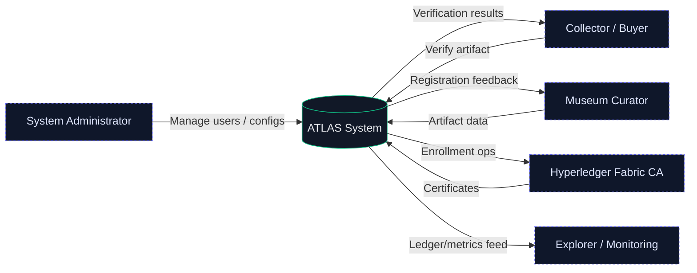

<h1 align="center">ATLAS – Cryptographically Securing Antiquities Provenance</h1>

ATLAS is a permissioned provenance and verification system for artifacts. It combines multi‑modal hashing (image, text, provenance), a planned Hyperledger Fabric ledger, and PostgreSQL (Neon) off‑chain storage to allow secure registration, verification, and controlled buyer access via time‑limited codes.

## Quick Start

```bash
npm install
npm run db:init   # create tables (idempotent)
npm run dev       # start Next.js dev server
```

Visit http://localhost:3000

| Page | Purpose |
|------|---------|
| /login | User login (hash or QR) |
| /dev-register | Developer-only user creation |
| /admin/access-codes | Staff control: generate & manage buyer access codes |
| /register | Artifact registration |
| /verify-secure | Buyer verification portal (access code gated) |

## Software Stack (Current & Planned)

**Frontend & API**: Next.js 16 (App Router), React 19, Tailwind CSS v4
**Off-Chain DB**: PostgreSQL (Neon capable) via `pg` / `@vercel/postgres`
**Access Control**: Local session + time-limited access codes (Fabric CA planned for staff identities)
**Hashing (prototype)**: SHA3‑512 composite from image/text/provenance components
**Blockchain (planned)**: Hyperledger Fabric 2.5.x (Raft), chaincode (Node.js)
**Optional Media**: IPFS (future) for large images & certificate PDFs
**Metrics**: prom-client `/api/metrics` endpoint (Grafana/Prometheus planned)
**CI/CD**: GitHub Actions (lint + build) – see `.github/workflows/ci.yml`
**Security**: CodeQL (planned), access code expiration, HMAC challenges for registration

## Multi-Modal Hash (Prototype)

Computed in `src/lib/hash.js`:
```
image_phash      = sha3-256(concat(normalized base64 views))
text_sig         = top frequency tokens (normalized) joined by '|'
provenance_digest= sha3-256(JSON(provenance))
combined_hash    = sha3-512(image_phash|text_sig|provenance_digest)
```
Stored columns: `combined_hash`, `image_phash`, `text_sig`, `provenance_digest` in `artifacts`.

## Access Codes (Now DB-backed)

PostgreSQL table `access_codes` replaces JSON file storage. API routes:
- `POST /api/access-codes/generate` – create code
- `GET /api/access-codes/list` – list codes (staff)
- `POST /api/access-codes/validate` – validate & increment usage
- `DELETE /api/access-codes/validate` – delete code
- `DELETE /api/access-codes/list` – cleanup expired

## Data Flow Diagrams

### Level 0 (Context)


### Level 1 (Internal)
```mermaid
graph LR
	classDef proc fill:#0f172a,stroke:#10b981,stroke-width:1,color:#e2e8f0;
	classDef store fill:#1e293b,stroke:#64748b,stroke-width:1,color:#cbd5e1;
	classDef ext fill:#0f172a,stroke:#6366f1,stroke-width:1,color:#e0e7ff,stroke-dasharray:3 3;
	Admin[System Admin]:::ext
	Curator[Museum Curator]:::ext
	Buyer[Collector / Buyer]:::ext
	CA[Fabric CA]:::ext
	Monitor[Explorer / Monitoring]:::ext
	P1[Auth & Session\n(Access Codes + RBAC planned)]:::proc
	P2[Artifact Registration]:::proc
	P3[Multi-Modal Hash Engine]:::proc
	P4[Provenance Recording (Fabric planned)]:::proc
	P5[Integrity Validation]:::proc
	P6[Verification & Certificates]:::proc
	P7[Off-Chain Data (Postgres/IPFS)]:::proc
	P8[Audit & Monitoring]:::proc
	D1[(Users & Roles\nPostgreSQL)]:::store
	D2[(Artifacts + Hashes\nPostgreSQL)]:::store
	D3[(Images / Certs\nIPFS optional)]:::store
	D4[(Hash Index\nFabric World State)]:::store
	D5[(Provenance Records\nFabric Ledger)]:::store
	D6[(Audit Logs / Events)]:::store
	D7[(Hash Components Archive)]:::store
	Admin --> P1
	Curator --> P1
	Buyer --> P1
	P1 --> D1
	P1 --> P2
	P2 --> P3
	P2 --> D2
	P2 --> P7
	P3 --> D7
	P3 --> P4
	P4 --> D5
	P4 --> D4
	P4 --> D6
	Buyer --> P6
	P6 --> D2
	P6 --> P5
	P5 --> D5
	P5 --> D4
	P5 --> D7
	P5 --> D6
	P6 --> Buyer
	P7 --> D3
	D5 --> P8
	D6 --> P8
	P8 --> Monitor
	P1 --> CA
	CA --> P1
```

## Roadmap (Next Milestones)
1. Fabric dev network & chaincode (register / transfer / provenance query)
2. Staff identity via Fabric CA (replace simulated blockchain table)
3. IPFS integration for large media (CID recorded on-chain)
4. Verification integrity PASS/FAIL based on ledger vs recompute
5. Metrics dashboards (Grafana) & structured logs

## Contributing
Pull requests welcome. Ensure lint passes & include minimal tests for new modules.

## License
Proprietary (pending final license selection). Contact maintainers for usage inquiries.

